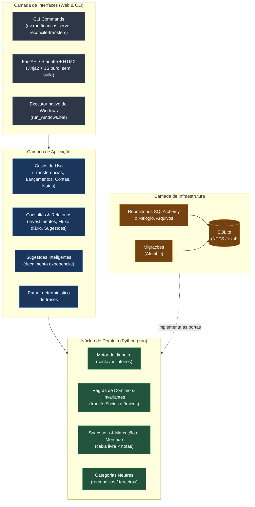

# Finanças Pessoais


Gestão financeira pessoal **100% local, sem nuvem e com um motor financeiro determinístico**: contas, cartões com faturas e parcelas, investimentos de renda fixa e patrimônio, tudo calculado na hora a partir dos seus lançamentos, em **centavos inteiros** (nunca ponto flutuante). Nenhum dado financeiro sai do seu computador.

> **v1.2.0.** Fases 0 a 4 prontas, front v3, modo demonstração e importação por arquivo, mais: seleção em lote, cartões unificados, divisão de lançamentos em itens, sugestões inteligentes, transferências ligadas, categorias neutras, investimentos por notas com saldos datados e execução nativa no Windows. A fase seguinte é opcional: servidor fechado, autenticação e backup criptografado ([roadmap](#roadmap)).

## Arquitetura

Arquitetura limpa (hexagonal): as dependências apontam sempre para dentro e o domínio não conhece framework, banco nem tela. A infraestrutura **implementa as portas** que o domínio define. As camadas são verificadas por `import-linter`.



Fechamento de fatura e parcelas são funções puras com testes em tabela; os casos de uso recebem repositórios por injeção; `container.py` é a única raiz de composição.

| Camada | Escolha |
|---|---|
| Linguagem e pacotes | Python 3.12+, uv |
| Persistência | SQLite, SQLAlchemy 2.0, Alembic |
| Web | FastAPI, Jinja2, HTMX, módulos JS estáticos (sem build) |
| CLI | Typer |
| Qualidade | pytest, ruff, pyright, import-linter |

## Principais funcionalidades

### Gestão bancária e lançamentos
- **Autocomplete inteligente** na descrição: sugere o que você costuma lançar (frequência com decaimento no tempo) e já preenche categoria, conta, forma de pagamento e valor habitual.
- **Gastos do dia e Saldo da conta:** cada dia mostra o consumo e o saldo acumulado no fim dele, como o extrato.
- **Categorias neutras (reembolsos / terceiros):** o dinheiro que só atravessa a conta move o saldo do banco, mas não entra em gastos, receitas nem orçamento.
- **Transferências ligadas:** duas pontas que se editam e se apagam juntas, com etiquetas “↔ Para / De / Aporte” que levam à outra ponta.
- Divisão de um lançamento em itens, mesclagem e apagamento em lote (modo de seleção), forma de pagamento, estabelecimentos e Revisão Rápida.

### Cartões e faturas
- Compras uma a uma, à vista, parceladas ou em andamento; fatura com status, vencimento, pagamento e conferência com o total do banco.
- **Visão unificada** de todos os cartões, limite comprometido por fatura, **antecipação** de parcelas com desconto opcional e fechamento calculado a partir do vencimento.

### Investimentos e patrimônio
- **Notas de renda fixa** (CDB, LCI, LCA, Tesouro...) com **snapshots de saldo** datados, histórico por nota e rentabilidade nominal e percentual.
- **Saldo livre × saldo aplicado:** o que chegou por transferência e ainda não está numa nota, separado do valor de mercado das aplicações; aportes e resgates numa seção própria.
- Escada de vencimentos, liquidez, exposição ao FGC, reserva de emergência e posição em 31/12. O sistema não calcula imposto.
- Painel e Análises: patrimônio no tempo, ritmo do mês, fluxo de caixa; **Carta do mês**, **E se…** e **Comando ⌘K**.

### Design e usabilidade
- **Seletor de cores** com código HEX, cores sugeridas e **conta-gotas** (EyeDropper) nos navegadores que oferecem.
- Ao salvar um lançamento, a lista vai para o mês dele, rola até a linha e a destaca.
- Tema claro, escuro e automático; **modo privacidade** (tecla `P`) que desfoca todos os valores; números tabulares e micro-interações que respeitam `prefers-reduced-motion`.
- **Modo demonstração** pronto (`financas demo`) e **importação por arquivo** (`/importar`) com resumo, erros por linha, backup e tudo-ou-nada.

## Guia rápido de instalação e execução

Pré-requisitos: Python 3.12+ e [uv](https://docs.astral.sh/uv/).

### Windows nativo (sem WSL)

```powershell
winget install --id astral-sh.uv     # uma vez só
git clone <url-do-repositorio> financas-pessoais
cd financas-pessoais
uv sync                              # dependências
.\run_windows.bat                    # painel em http://127.0.0.1:8000
```

O `run_windows.bat` usa um ambiente próprio (`.venv-win`) para não brigar com o `.venv` do WSL. Os demais comandos funcionam igual (`uv run financas backup`, `uv run pytest -q`).

### Linux, macOS ou WSL

```bash
git clone <url-do-repositorio> financas-pessoais && cd financas-pessoais
uv sync
uv run financas init          # cria data/, aplica as migrations e semeia as categorias
uv run financas serve         # abra http://127.0.0.1:8000
uv run financas backup        # cópia consistente em data/backups/
```

**Ver a demonstração** (dados fictícios, banco `data/demo.db`, porta 8001): `uv run financas demo`, e abra http://localhost:8001.

## Testes e qualidade

Mais de 2.000 testes (unidade, contrato, integração e harnesses de navegador para gráficos, privacidade, seleção, cores e sugestões).

```bash
uv run pytest -q
uv run ruff check . && uv run ruff format --check .
uv run pyright
uv run lint-imports
```

## Documentação

| Para quê | Onde |
|---|---|
| Instalar, rodar no Windows, demonstração, backup e uso de cada recurso | [`docs/GUIA_DE_USO.md`](docs/GUIA_DE_USO.md) |
| Como o sistema calcula faturas, parcelas, investimentos, neutras e saldos | [`docs/CONCEITOS.md`](docs/CONCEITOS.md) |
| Formato do arquivo de importação | [`docs/IMPORTACAO_DADOS.md`](docs/IMPORTACAO_DADOS.md) |
| Registros de engenharia (auditorias, planos, histórico técnico) | `docs-dev/`, mantido só localmente (fora do git) |

[`CLAUDE.md`](CLAUDE.md) é o contrato do projeto (regras de domínio, arquitetura e convenções).

**Idioma.** Código, tabelas, colunas, enums e especificações em inglês; tudo o que o usuário vê, em português com acentos, apenas na camada `interfaces/`.

## Privacidade e segurança

- Dados reais em `data/`, fora do git: bancos, planilhas, backups e `.env` são ignorados; os testes usam só dados sintéticos. A única exceção versionada é `data/demo.db`, o banco fictício da demonstração.
- Como os dados são digitados, o banco local é a única cópia: faça `financas backup` e guarde cópias em outro disco. Não deixe `data/` em pasta sincronizada na nuvem.
- O servidor escuta só em `127.0.0.1` (o comando `serve` recusa outros endereços); nenhum dado financeiro vai para a internet.

## Roadmap

- [x] Fase 0, bootstrap · Fase 1, núcleo manual · Fase 2, cartões · Fase 3, investimentos e patrimônio · Fase 4, orçamento, recorrentes e fluxo diário
- [x] Front v3, modo demonstração, importação por arquivo, Windows nativo, notas de investimento e categorias neutras
- [ ] Fase 5, opcional: servidor fechado (Docker + VPN), autenticação, HTTPS e backup criptografado

**Adiado, só sob pedido:** importação de extratos, faturas e planilhas de banco; classificação automática por regras; Open Finance; assistente com modelo de linguagem externo.

## Licença

Projeto de uso pessoal, sem licença definida.
